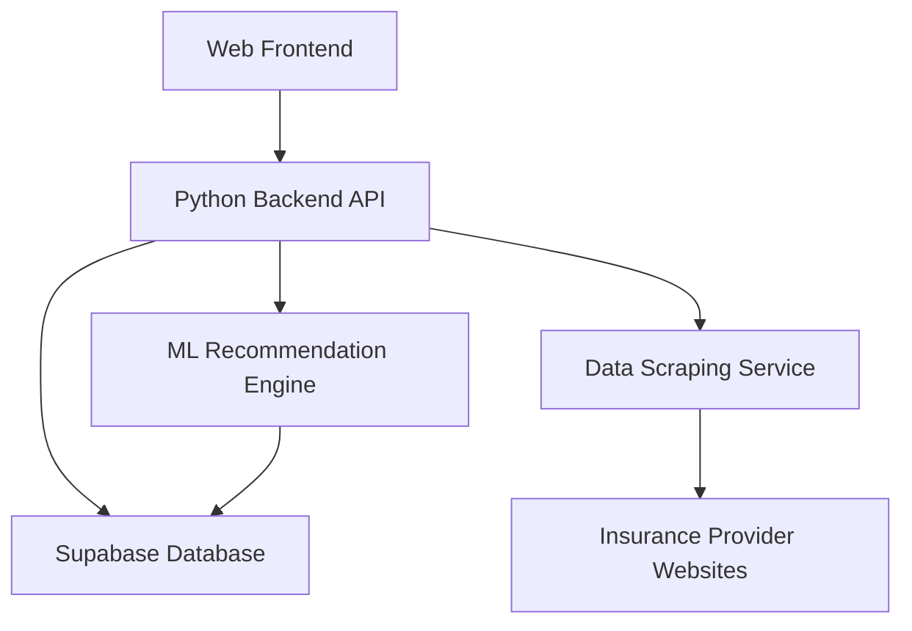

# Swiss Health Insurance Assistant

## Overview

The Swiss Health Insurance Assistant is an AI-powered web application designed to help people in Switzerland find the most suitable health insurance plans based on their individual needs, including age, medical history, financial situation, and lifestyle preferences.

## Key Features

- 🤖 AI-powered insurance recommendation engine
- 📊 Comprehensive comparison of Swiss health insurance plans
- 🔄 Real-time data updates from insurance providers
- 👤 Personalized user profiles
- 📱 Responsive web interface
- 🔒 Secure data handling

## Quick Links

- [Getting Started](getting-started/overview.md)
- [System Architecture](architecture/system-overview.md)
- [API Documentation](api/overview.md)
- [Contributing Guidelines](contributing/guidelines.md)

## System Architecture

## Technology Stack

- **Frontend**: React.js, Material-UI/Tailwind CSS
- **Backend**: Python FastAPI
- **Database**: Supabase
- **ML/AI**: scikit-learn/TensorFlow
- **Infrastructure**: Docker, Kubernetes

## Getting Started

For development setup and contribution guidelines, please refer to our [Getting Started Guide](getting-started/overview.md).

## License

This project is licensed under the MIT License - see the [LICENSE](LICENSE) file for details.